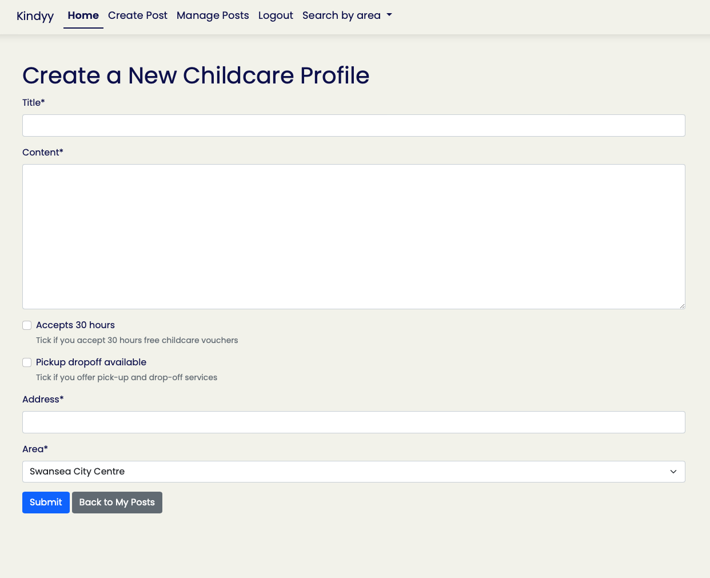
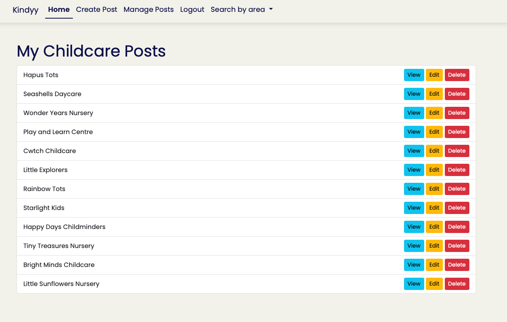

Welcome Anastasiya McAvoy,

## Code Institute - Milestone project 3: Backend Development
## KINDYY

### About

## About Kindyy

**Kindyy** is a local childcare directory designed to help parents quickly find and connect with trusted nurseries and childminders in their area. The platform allows registered childcare providers to create and manage detailed business profiles, highlighting their services, location, and availability.

The idea for Kindyy came from my own experience as a parent struggling to find suitable childcare in my area. The search process was time-consuming, fragmented, and often frustrating — so I wanted to create a single, easy-to-use platform that brings together local providers and parents in one place.

Parents can browse listings, filter by area and service options, and view key information such as facilities offered, funding eligibility, and contact details. Kindyy aims to simplify the search process for families while giving providers an easy way to promote their services in the local community.

Built with **Django** and a responsive, mobile-friendly design, Kindyy offers a smooth experience for both providers and parents on any device.

View live website [HERE](https://kindyy-3dd7c64206c7.herokuapp.com)

## Table Of Contents:

1. [Design & Planning](#design-&-planning)

   - [User Stories](#user-stories)
   - [Wireframes](#wireframes)
   - [Typography](#typography)
   - [Colour Scheme](#colour-scheme)

2. [Features](#features)
3. [Data Sceema](#data-sceema)

4. [Technologies](#technologies)
    - [Languages Used](#languages-used)
    - [Frameworks Libraries and Programmes Used](#frameworks)
5. [Testing](#testing)
6. [Bugs](#bugs)
7. [Deployment](#deployment)
8. [Credits](#credits)

## Design & Planning:

## Customer (Parent) User Stories

### 1. User Story: Browse providers in my town  
**As a parent,**  
- I want to browse childcare providers in Swansea  
**So that I can**  
- Find suitable childcare options.  

### 2. User Story: Filter by specific area.  
**As a parent,**  
- I want to filter providers by specific area.  
**So that I can**  
- Find suitable childcare in my area, close to home or work.  

### 3. User Story: View detailed provider profiles  
**As a parent,**  
- I want to view full profiles with services, descriptions, and location  
**So that I can**  
- Make an informed decision about childcare.

---

## Provider (Nursery / Childminder) User Stories

### 1. User Story: Create and log into an account  
**As a provider,**  
- I want to create an account and log in  
**So that I can**  
- Manage my childcare listing securely.

### 2. User Story: Create and publish a business profile  
**As a provider,**  
- I want to create and publish my business profile  
**So that I can**  
- Attract parents looking for childcare.

### 3. User Story: Add detailed service information  
**As a provider,**  
- I want to add details about my services (e.g., 30 free hours, pick-up/drop-off)  
**So that I can**  
- Help parents understand what I offer.

### 4. User Story: Update my profile  
**As a provider,**  
- I want to edit my profile information easily  
**So that I can**  
- Keep my details accurate and relevant.

### 5. User Story: Delete my listing  
**As a provider,**  
- I want to delete my listing  
**So that I can**  
- Stop receiving inquiries when I have no availability.

### Future developments

- **User Reviews and Ratings**  
Allow parents to leave reviews and rate childcare providers, helping others make informed decisions.

- **Advanced Search & Filters**  
Add filters for more detailed search criteria like age groups accepted, special needs support, opening hours, price range, and languages spoken.

- **Booking and Availability Calendar**  
Enable parents to check availability and book childcare slots directly through the platform.

- **User Profiles and Dashboards**  
Provide both parents and providers with personalized dashboards to manage their bookings, posts, preferences, and communication.

- **Messaging System**  
Add an internal messaging feature so parents and providers can communicate securely without sharing personal contact details.

- **Mobile App Development**  
Create a mobile app for easier access on the go, with push notifications for booking updates or new posts.

- **Integration with Payment Systems**  
Facilitate secure payments or deposits for childcare services through the platform.

- **AAA WCAG Accessibility Standards**  
Further development for this site to be fully accessible with best practices followed so that it's fully compatible with assistive technologies.

### Wireframes

This site is designed to be simple, clean, and distraction-free. 

Final MVP version:  

  
  
  
  
  
  
  
  
  

### Typography

- For my Kindyy website, font chosen is **Poppins**, a clean and modern font known for it's geometric shapes and excellent readability. This font choice creates a friendly and approachable feel, which aligns perfectly with the site’s mission to support families and childcare providers. Using Poppins ensures that the text appears clear and consistent across all devices and screen sizes.
Overall, the typography balances professionalism with warmth, helping users feel welcomed while providing an easy-to-navigate, trustworthy experience.

### Colour Sceeme

- Color scheme for Kindyy has been carefully selected to create a clean, soft, and simple visual experience that keeps the focus on our core mission: connecting families with local childcare providers. The palette combines a calming background of soft off-white tones with soothing soft blue. This conveys professionalism and warmth, helping to establish a welcoming atmosphere for users.

The text color ensures strong contrast against the light backgrounds, supporting readability and accessibility for users with varying vision needs. 

Overall, this accessible and thoughtfully curated color palette supports an intuitive user experience by reducing distractions and highlighting key information, enabling families and providers to engage effortlessly with the platform.

## Features:

- User registration and authentication with secure login/logout.
- Full CRUD functionality for childcare provider posts (Create, Read, Update, Delete).
- Search and filter posts by area and service options.
- Pagination for browsing large sets of posts efficiently.
- Confirmation modal before delete actions to prevent accidental removals.
- Redirect users to the page where their post appears immediately after creation.
- Dynamic UI updates after CRUD actions to reflect changes without full page reloads.
- Responsive design ensuring usability across devices.
- Integration with third-party authentication using django-allauth.
- Clear visual feedback using icons for features like pickup/drop-off and 30 hours free childcare.
- Accessibility-conscious color scheme and typography for easy readability.

## Data Sceema

- 

## Technologies 

### Languages Used

- HTML - To create a basic site structure.
- CSS - To create custom styles.
- Python - To create custom models & views.
- Bootstrap - For consistent styling and improved responsiveness.
- Markdown - To create a README file. 

### Frameworks Libraries and Programmes Used

- Font Awesome - for icons.
- Favicon.io - to create a favicon.
- Colormind.io - to create a colour scheme.
- Google Fonts - for custom font size that fits with the of the industry.
- GitPod - to develop project and organise version control.
- Devtools - for debugging and adjusting layouts.
- Lighthouse - for testing especially performance related issues.
- Wave evaluation tool - for any accessibility related issues.
- Chat GPT - for generating site content.
- axe DevTools - for any accessibility related issues.
- Django 
- Heroku 
- Installed apps & libraries

## Testing

Throughout the development of this project, I have conducted several rounds of testing to ensure a smooth user experience, robust functionality, and adherence to web standards. The testing covered browser compatibility, accessibility, functionality, real device testing, and UI/UX design which was achieved through a combination of manual testing and use of code validators, tools like Lighthouse & plugins and validators.

_Manual Testing:_ The core features 

_Error Handling:_ 

### Google's Lighthouse Performance

- WEB browser  
  
  
  
  
  
   

- Mobile  
  
  
  
  
  
   

### Browser Compatibility

| Browser tested | Intended appearance | Intended responsiveness |
| -------------- | ------------------- | ----------------------- |
| Chrome         | Good                | Good                    |
| FireFox        | Good                | Good                    |
| Safari         | Good                | Good                    |

### Responsiveness

This is tested on a combination of real life devices and well as responsive viewer in Chrome. No issues observed.

- iPhone SE
- iPhone 13
- Serface pro 7
- Nest hub MAX
- Google pixel 8a
- Web Browser

### Code Validation

Validation completed vith no errors.

- CSS    

- JS HINT  

- HTML  
  
  
  
  
  
   

### Manual Testing user stories or/and features

### Accessibility

The colors have been carefully selected to comply with accessibility contrast standards, ensuring readability and visual clarity for all users. To verify these standards, the site has been tested using the WAVE & axe DevTools plugins on Chrome, which checks for any potential accessibility issues. And in accordance to axe DevTools has acheived a WCAG 2.1 AA standard.

Additionally, further manual testing with VoiceOver and using tab navigation has also been performed to ensure that the game is fully usabe for users with impairments or using asistive technologies, further enhancing the user experience for a diverse audience.

This will be further addressed in the future developments to reach full AAA standard.

## Bugs

_Issue_: 
_Cause_: 
_Solution_: 

_Issue_:   
_Cause_: 
_Solution_:  

_Issue_: 
_Cause_: 
_Solution_: 

_Issue_:  
_Cause_: 
_Solution_: 

_Issue_: 
_Cause_: 
_Solution_:   

_Issue_:  
_Cause_: 
_Solution_:   

_Issue_: 
_Cause_: 
_Solution_: 

## Known Issues

- Search areas only appear on home page. All areas appear on all pages.

## Deployment

#### Creating Repository on GitHub

1. First make sure you are signed into [Github](https://github.com/) and go to the code institutes template, which can be found [here](https://github.com/Code-Institute-Org/gitpod-full-template).
2. Then click on **use this template** and select **Create a new repository** from the drop-down. Enter the name for the repository and click **Create repository from template**.
3. Once the repository was created, I clicked the green **gitpod** button to create a workspace in gitpod so that I could write the code for the site.
4. Use terminal command to link it to VS code.

#### Deploying on Heroku

The site was deployed to Heroku app using the following method:

1. 
2. 

## Credits

### Special thanks:

**David Bowers** for support and mentoring.  
**Marco** for continuous support and unlimited information.  
**Kyle** for being my number one motivator and biggest fan.

---
