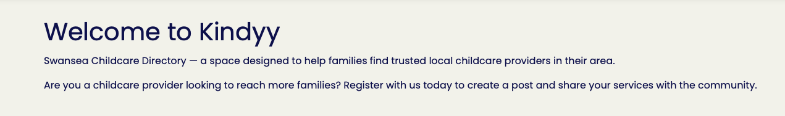
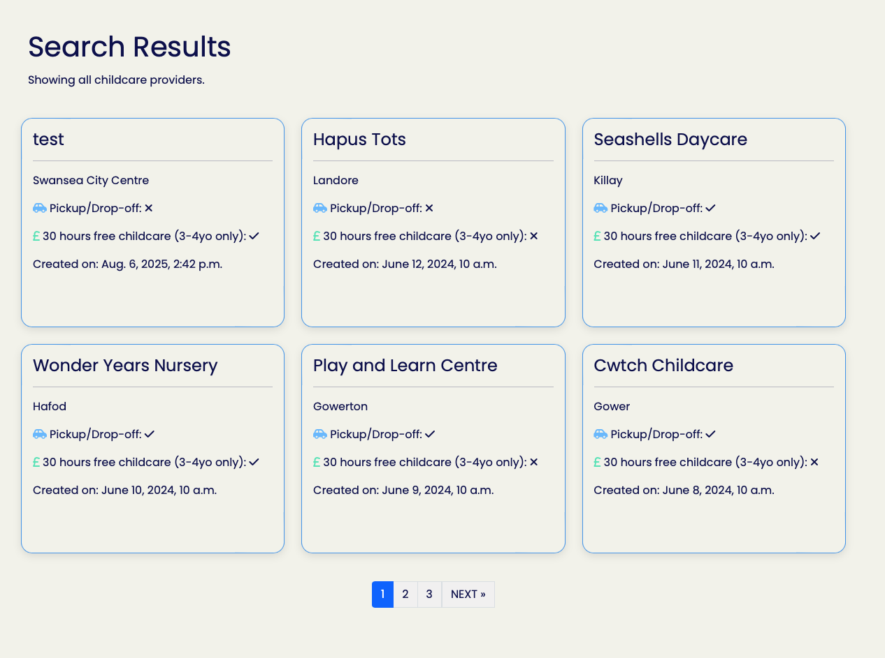
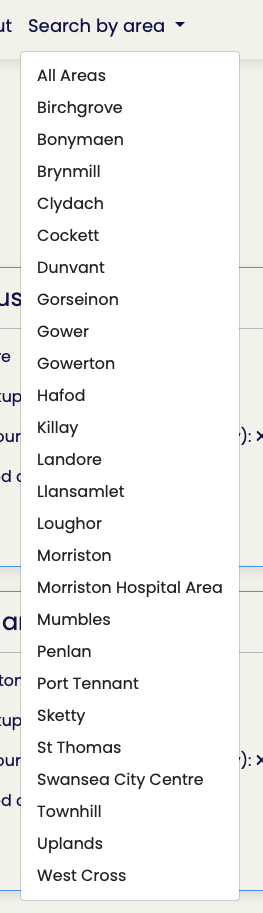
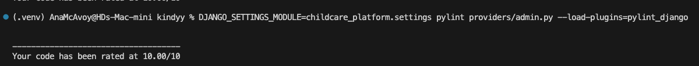

Welcome Anastasiya McAvoy,

## Code Institute - Milestone project 3: Backend Development
## KINDYY

### About

## About Kindyy

**Kindyy** is a local childcare directory designed to help parents quickly find and connect with trusted nurseries and childminders in their area. The platform allows registered childcare providers to create and manage detailed business profiles, highlighting their services, location, and availability.

The idea for Kindyy came from my own experience as a parent struggling to find suitable childcare in my area. The search process was time-consuming, fragmented, and often frustrating — so I wanted to create a single, easy-to-use platform that brings together local providers and parents in one place.

Parents can browse listings, filter by area and service options, and view key information such as facilities offered, funding eligibility, and contact details. Kindyy aims to simplify the search process for families while giving providers an easy way to promote their services in the local community.

Built with **Django** and a responsive, mobile-friendly design, Kindyy offers a smooth experience for both providers and parents on any device.


View live website [HERE](https://kindyy-3dd7c64206c7.herokuapp.com)


## Table Of Contents:

1. [Design & Planning](#design-&-planning)

   - [User Stories](#user-stories)
   - [Wireframes](#wireframes)
   - [Typography](#typography)
   - [Colour Scheme](#colour-scheme)

2. [Features](#features)
    - [User Features](#user-features)
    - [Security Features](#security-features)
3. [Data Sceema](#data-sceema)
4. [Technologies](#technologies)
    - [Languages Used](#languages-used)
    - [Frameworks Libraries and Programmes Used](#frameworks)
5. [Testing](#testing)
6. [Bugs](#bugs)
7. [Deployment](#deployment)
8. [Credits](#credits)

## Design & Planning:

## Customer (Parent) User Stories

### 1. User Story: Browse providers in my town  
**As a parent,**  
- I want to browse childcare providers in Swansea  
**So that I can**  
- Find suitable childcare options.  

### 2. User Story: Filter by specific area.  
**As a parent,**  
- I want to filter providers by specific area.  
**So that I can**  
- Find suitable childcare in my area, close to home or work.  

### 3. User Story: View detailed provider profiles  
**As a parent,**  
- I want to view full profiles with services, descriptions, and location  
**So that I can**  
- Make an informed decision about childcare.

---

## Provider (Nursery / Childminder) User Stories

### 1. User Story: Create and log into an account  
**As a provider,**  
- I want to create an account and log in  
**So that I can**  
- Manage my childcare listing securely.

### 2. User Story: Create and publish a business profile  
**As a provider,**  
- I want to create and publish my business profile  
**So that I can**  
- Attract parents looking for childcare.

### 3. User Story: Add detailed service information  
**As a provider,**  
- I want to add details about my services (e.g., 30 free hours, pick-up/drop-off)  
**So that I can**  
- Help parents understand what I offer.

### 4. User Story: Update my profile  
**As a provider,**  
- I want to edit my profile information easily  
**So that I can**  
- Keep my details accurate and relevant.

### 5. User Story: Delete my listing  
**As a provider,**  
- I want to delete my listing  
**So that I can**  
- Stop receiving inquiries when I have no availability.

### Future developments

- **User Reviews and Ratings**  
Allow parents to leave reviews and rate childcare providers, helping others make informed decisions.

- **Advanced Search & Filters**  
Add filters for more detailed search criteria like age groups accepted, special needs support, opening hours, price range, and languages spoken.

- **Booking and Availability Calendar**  
Enable parents to check availability and book childcare slots directly through the platform.

- **User Profiles and Dashboards**  
Provide both parents and providers with personalized dashboards to manage their bookings, posts, preferences, and communication.

- **Messaging System**  
Add an internal messaging feature so parents and providers can communicate securely without sharing personal contact details.

- **Mobile App Development**  
Create a mobile app for easier access on the go, with push notifications for booking updates or new posts.

- **Integration with Payment Systems**  
Facilitate secure payments or deposits for childcare services through the platform.

- **AAA WCAG Accessibility Standards**  
Further development for this site to be fully accessible with best practices followed so that it's fully compatible with assistive technologies.

### Wireframes

This site is designed to be simple, clean, and distraction-free. 


Final MVP version:  

  
  
  
  
  
  
  
  
  


### Typography

- For my Kindyy website, font chosen is **Poppins**, a clean and modern font known for it's geometric shapes and excellent readability. This font choice creates a friendly and approachable feel, which aligns perfectly with the site’s mission to support families and childcare providers. Using Poppins ensures that the text appears clear and consistent across all devices and screen sizes.
Overall, the typography balances professionalism with warmth, helping users feel welcomed while providing an easy-to-navigate, trustworthy experience.

### Colour Sceeme

- Color scheme for Kindyy has been carefully selected to create a clean, soft, and simple visual experience that keeps the focus on our core mission: connecting families with local childcare providers. The palette combines a calming background of soft off-white tones with soothing soft blue. This conveys professionalism and warmth, helping to establish a welcoming atmosphere for users.

The text color ensures strong contrast against the light backgrounds, supporting readability and accessibility for users with varying vision needs. 

Overall, this accessible and thoughtfully curated color palette supports an intuitive user experience by reducing distractions and highlighting key information, enabling families and providers to engage effortlessly with the platform.


## Features:

### User features 
- User registration and authentication with secure login/logout.
- Full CRUD functionality for childcare provider posts (Create, Read, Update, Delete).
- Search and filter posts by area and service options.
- Pagination for browsing large sets of posts efficiently.
- Confirmation modal before delete actions to prevent accidental removals.
- Redirect users to the page where their post appears immediately after creation.
- Dynamic UI updates after CRUD actions to reflect changes without full page reloads.
- Responsive design ensuring usability across devices.
- Integration with third-party authentication using django-allauth.
- Clear visual feedback using icons for features like pickup/drop-off and 30 hours free childcare.
- Accessibility-conscious color scheme and typography for easy readability.

### Security features

Security has been carefully considered throughout the design and development of this childcare platform to protect both users and data. Key security measures include:

- User Authentication and Authorization: The application uses Django’s built-in authentication system, enhanced with `django-allauth` for secure user registration and login. Certain actions such as creating, editing, or deleting posts are restricted to authenticated users only, preventing unauthorized access.  

- Ownership Verification: Editing and deleting posts require ownership verification, ensuring users can only modify or remove posts they have created. This prevents unauthorized modifications to other users’ data.

- Secure Secret Management: Sensitive data such as secret keys and database URLs are managed through environment variables and not hard-coded, minimizing the risk of accidental exposure.

- Use of Whitenoise: Static files are served securely with Whitenoise middleware, reducing reliance on external services and lowering attack surfaces.

- Admin Approval for Posts: Posts typically require approval by an admin before being published to ensure content quality and security. However, this feature is temporarily disabled to facilitate testing and assessment of the project. In a production environment, enabling this approval process helps prevent unauthorized or inappropriate content from being publicly visible.


## Data Schema

### Entities and Attributes

- **User**  
  - id (Primary Key)  
  - username  
  - email  
  - password  

- **Post**  
  - id (Primary Key)  
  - title  
  - slug  
  - content  
  - status (draft/published)  
  - accepts_30_hours (boolean)  
  - pickup_dropoff_available (boolean)  
  - address  
  - created_on (timestamp)  
  - area (choice field)  
  - author_id (Foreign Key to User)

### Relationships

- A **User** can create multiple **Posts** (One-to-Many)  
- Each **Post** is authored by a single **User**

### Schema table 

| Field Name              | Data Type         | Constraints / Options                           | Description                                              |
|-------------------------|-------------------|------------------------------------------------|----------------------------------------------------------|
| `id`                    | Integer (Auto)    | Primary Key, Auto-increment                     | Unique identifier for each post                           |
| `title`                 | CharField (200)   | Unique, Required                                | Title of the childcare provider post                      |
| `slug`                  | SlugField (200)   | Unique, Auto-generated if blank                 | URL-friendly unique identifier for the post               |
| `author`                | ForeignKey (User) | Required, on_delete=CASCADE                      | Reference to the user who created the post                |
| `content`               | TextField         | Required                                        | Main content/description of the childcare services        |
| `status`                | IntegerField      | Choices: Draft (0), Published (1), Default=1   | Post status to control visibility                          |
| `accepts_30_hours`      | BooleanField      | Default=False                                   | Whether 30 hours free childcare vouchers are accepted     |
| `pickup_dropoff_available`| BooleanField    | Default=False                                   | Whether pick-up/drop-off services are offered              |
| `address`               | CharField (100)   | Required                                        | Address of the childcare provider                          |
| `created_on`            | DateTimeField     | Auto_now_add=True                               | Timestamp of when the post was created                      |
| `area`                  | CharField (50)    | Choices: SWANSEA_AREAS, Default='swansea_city_centre' | Geographic area of the provider's location             |


## Technologies 

### Languages Used

- HTML - To create a basic site structure.
- CSS - To create custom styles.
- Python - To create custom models & views.
- Bootstrap - For consistent styling and improved responsiveness.
- Markdown - To create a README file. 

### Frameworks Libraries and Programmes Used

- Django - The web framework used to develop the full-stack application.
- Font Awesome - for icons.
- Favicon.io - to create a favicon.
- Colormind.io - to create a colour scheme.
- Google Fonts - for custom font size that fits with the of the industry.
- GitPod - to develop project and organise version control.
- Devtools - for debugging and adjusting layouts.
- Lighthouse - for testing especially performance related issues.
- Wave evaluation tool - for any accessibility related issues.
- Chat GPT - for generating content and documentation.
- axe DevTools - for any accessibility related issues.
- Heroku - Cloud platform used for hosting and deploying the Django application.
- Installed Django Apps & Libraries — Including:
    - `django-allauth` for user authentication and social login
    - `crispy-forms` and `crispy-bootstrap5` for improved form styling
    - `django-summernote` for rich text editing in admin
    - `Whitenoise`  for static file serving in production.
    - `Gunicorn` for running Django on Heroku.
    - `Psycopg2` PostgreSQL database adapter for Python.
    - `Bootstrap` CSS framework for responsive design.

## Testing

Throughout the development of this project, I have conducted several rounds of testing to ensure a smooth user experience, robust functionality, and adherence to web standards. The testing covered browser compatibility, accessibility, functionality, real device testing, and UI/UX design which was achieved through a combination of manual testing and use of code validators, tools like Lighthouse & plugins and validators.

_Manual Testing:_  
The core features such as user registration, login/logout, creating, editing, and deleting posts were tested manually on multiple browsers and devices. User flows were verified to ensure that navigation, form submissions, and dynamic content updates functioned as expected.

_Error Handling:_  
The application gracefully handles errors such as invalid form submissions and unauthorized access attempts. User-friendly messages guide the user to correct any mistakes, and proper HTTP responses are returned for server errors.

### Google's Lighthouse Performance

- WEB browser  
  


### Browser Compatibility

| Browser tested | Intended appearance | Intended responsiveness |
| -------------- | ------------------- | ----------------------- |
| Chrome         | Good                | Good                    |
| FireFox        | Good                | Good                    |
| Safari         | Good                | Good                    |

### Responsiveness

This is tested on a combination of real life devices and well as responsive viewer in Chrome. No issues observed.

- iPhone SE
- iPhone 13
- Serface pro 7
- Nest hub MAX
- Google pixel 8a
- Web Browser

### Code Validation

Validation completed vith no errors.

- CSS    

- Pylint (VScode) 



- HTML  
  
  
  
  


### Manual Testing user stories or/and features

### Accessibility

The colors have been carefully selected to comply with accessibility contrast standards, ensuring readability and visual clarity for all users. To verify these standards, the site has been tested using the WAVE & axe DevTools plugins on Chrome, which checks for any potential accessibility issues. And in accordance to axe DevTools has acheived a WCAG 2.1 AA standard.

This will be further addressed in the future developments to reach full AAA standard.


## Bugs

### Issue:
Error seen in Heroku following deployment.  
**Cause:** Incorrect file name in Procfile.  
**Solution:** Change file name from *kindyy* to *childcare_platform*.

---

### Issue:
Swansea areas not appearing in the dropdown on the home page.  
**Cause:** Areas are not being passed to the template.  
**Solution:** Pass `swansea_areas` to the template via `views.py`.

---

### Issue:
Areas not showing user-friendly names in search dropdown.  
**Cause:** First element of the tuple is displayed, as it's the way it is stored in the database.  
**Solution:** Use Django shortcut `post.get_area_display()` to display the label instead of the stored value.

---

### Issue:
App is broken after using code formatter.  
**Cause:** By using the formatter, many lines of code were split across multiple lines causing breakages in the code and issues with HTML code checkers.  
**Solution:** Manually fix any issues by returning code to a single line.

---

### Issue:
Footer CSS styles not being applied.  
**Cause:** Footer was incorrectly placed inside the card section.  
**Solution:** Move footer outside of the card section.

---

### Issue:
Not able to use 'Am I Responsive' checker.  
**Cause:** Django security setting preventing itself from being embedded inside an iframe.  
**Solution:** Temporarily override this feature by changing settings to `X_FRAME_OPTIONS = "ALLOWALL"`.

---

### Issue:
Nav link colours are not updating.  
**Cause:** Bootstrap default settings.  
**Solution:** Use higher specificity for links.

---

### Issue:
Linter warning for env file is being loaded but unused.  
**Cause:** `env.py` file is used to load the secret key, but Django (and linters) cannot detect its usage, so it thinks it is unused.  
**Solution:** Use an inline comment to tell the linter to ignore the warning, since this is intentional to protect the secret key.

## Deployment

#### Creating Repository on GitHub

1. First make sure you are signed into [Github](https://github.com/) and go to the code institutes template, which can be found [here](https://github.com/Code-Institute-Org/gitpod-full-template).
2. Then click on **use this template** and select **Create a new repository** from the drop-down. Enter the name for the repository and click **Create repository from template**.
3. Once the repository was created, I clicked the green **gitpod** button to create a workspace in gitpod so that I could write the code for the site.
4. Use terminal command to link it to VS code.

#### Deploying on Heroku

The site was deployed to Heroku app using the following method:

1. Create and activate a virtual environment:
  - Run:
    ```bash
    python3 -m venv .venv
    source .venv/bin/activate  # macOS/Linux
    # OR
    .venv\Scripts\activate  # Windows
    ```

2. Install required Python packages:
  - Run:
    ```bash
    pip install django gunicorn dj-database-url psycopg2-binary whitenoise
    pip freeze > requirements.txt
    ```

3. Create a new Django project:
  - Run:
    ```bash
    django-admin startproject childcare_platform .
    ```

4. Create a new Django app called `providers`:
  - Run:
    ```bash
    python manage.py startapp providers
    ```

5. Register the `providers` app in `childcare_platform/settings.py`:
  - Add `'providers',` to the `INSTALLED_APPS` list.

6. Make and apply initial migrations:
  - Run:
    ```bash
    python manage.py makemigrations
    python manage.py migrate
    ```

7. Create a Django superuser:
  - Run:
    ```bash
    python manage.py createsuperuser
    ```

8. Collect static files:
  - Run:
    ```bash
    python manage.py collectstatic
    ```

9. Create a `Procfile` in the project root:
  - Add the following line to the file (no file extension):
    ```
    web: gunicorn childcare_platform.wsgi
    ```

10. Update `childcare_platform/settings.py` for Heroku:
  - Add `'whitenoise.middleware.WhiteNoiseMiddleware'` after `'SecurityMiddleware'` in the `MIDDLEWARE` list.
  - Set:
    ```python
    ALLOWED_HOSTS = ['.herokuapp.com']
    ```
  - Add static files settings:
    ```python
    STATIC_URL = '/static/'
    STATIC_ROOT = os.path.join(BASE_DIR, 'staticfiles')
    STATICFILES_STORAGE = 'whitenoise.storage.CompressedManifestStaticFilesStorage'
    ```
  - Configure the database:
    ```python
    import dj_database_url

    DATABASES = {
        'default': dj_database_url.config(default='sqlite:///db.sqlite3')
    }
    ```

11. Login to Heroku:
  - Run:
    ```bash
    heroku login
    ```
12. Connect GitHub repository:
  - Log into heroku dashboard
  - Go to 'Deploy' tab 
  - Connect to github 
  - Select Kindyy   

13. Add secret key:
  - Log into heroku dashboard
  - Go to 'Settings' tab 
  - Click reveal Config Vars 
  - Add SECRET_KEY value='django-secret-key'

14. Add database URL:
  - Log into heroku dashboard
  - Go to 'Settings' tab 
  - Click reveal Config Vars 
  - Add DATABASE_URL value='database_url'

15. Deploy to Heroku:
  - Log into heroku dashboard
  - Go to 'Deploy' tab 
  - Click on deploy branch
  - Wait for deployment to finish
  - Click on Open app at the top of the screen. 

16. Done! Kindyy is now live at: https://kindyy-3dd7c64206c7.herokuapp.com

### Special thanks:

**David Bowers** for support and mentoring.  
**Marco** for continuous support and unlimited information.  
**Kyle** for being my number one motivator and biggest fan.

---
